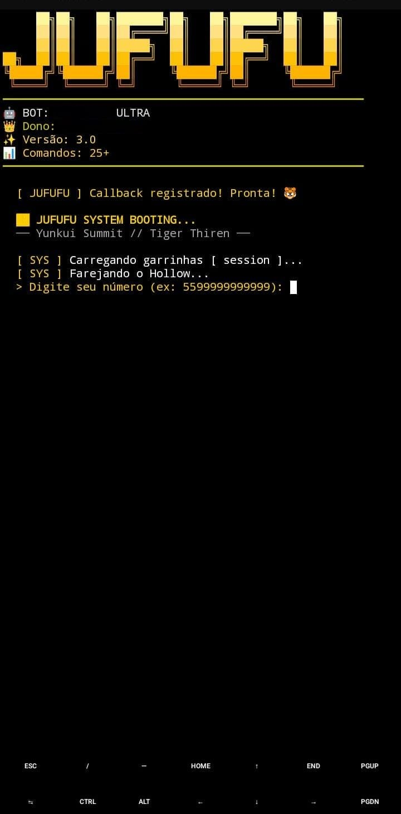
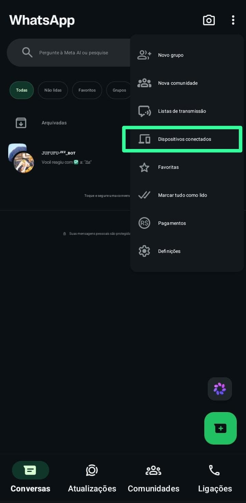
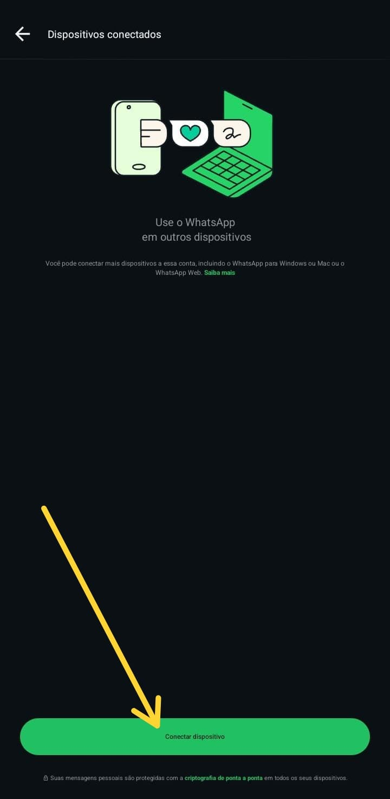
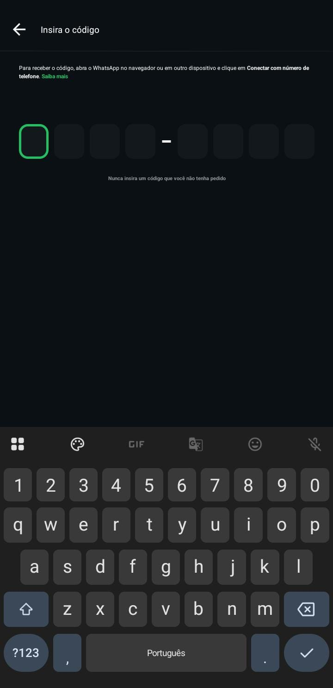
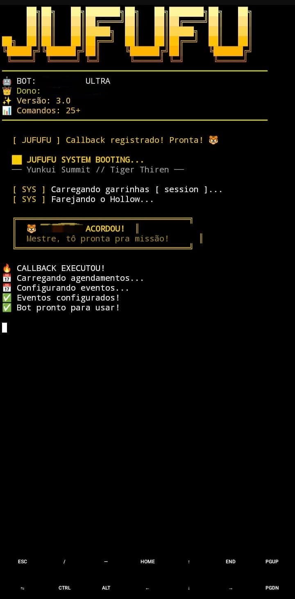

<div align="center">

# 🤖 BOT-JUFUFU


<br>


<br><br>

**JUFUFU BOT — UM BOT COMPLETO PARA WHATSAPP, COM DIVERSAS FUNCIONALIDADES**

<br>

<a href="https://github.com/elnataalves12-lang/BOT-JUFUFU-zzz/stargazers">
  
</a>
<a href="https://github.com/elnataalves12-lang/BOT-JUFUFU-zzz/network/members">
  
</a>
<a href="https://github.com/elnataalves12-lang/BOT-JUFUFU-zzz/issues">
  
</a>
<a href="https://github.com/elnataalves12-lang/BOT-JUFUFU-zzz">
  
</a>

</div>


## 📖 Sobre o Jufufu

O **Jufufu** é um bot completo para WhatsApp feito em **Node.js**.

Cada pessoa que baixar o projeto roda **sua própria cópia**, conectando **sua própria conta do WhatsApp**. O bot **não é um servidor público** — é um projeto **open source** para você instalar, personalizar e usar como quiser.

<div align="center">

### 🎯 O QUE VOCÊ VAI TER

| 🎵 Música | 📹 Vídeo | 🎨 Figurinhas | 🎮 RPG |
|:---:|:---:|:---:|:---:|
| Play, YouTube, TTS | Download e envio | Criação e pack | Completo com empregos |
| **🛡️ Moderação** | **🎭 Interações** | **👑 Menus** | **🎁 E muito mais** |
| Anti-link, blacklist | Tapa, beijo, abraço | App externo | AFK, perfil, XP |

</div>


## ✨ Funcionalidades

<div align="center">

### 🎵 MÍDIA E ENTRETENIMENTO
> Play • YouTube • Imagem IA • Pinterest • TTS • Efeitos de Áudio

### 🎨 FIGURINHAS
> Criar • Converter • Pack • Sticker → GIF • Sticker → Imagem

### 🛡️ MODERAÇÃO
> Anti-Link • Anti-Mídia • Anti-Palavrão • Blacklist • Proteção ADM

### 🎭 INTERAÇÃO
> Tapa • Beijo • Abraço • Soco • Matar • Casamento • Ship

### 🎮 RPG COMPLETO
> Trabalhar • Minerar • Favo de Mel • Cassino • Jogo da Velha • Quiz

### 🏆 RANKINGS E STATUS
> Rank Ativo • XP • Nível • Rankings (feio, bonito, gay...)

### 👑 MENUS E CONFIG
> Menu Principal • Menu ADM • Menu Dono • Bem-vindos • Agendamentos

### 💤 UTILIDADES
> AFK • Perfil • BotInfo • Revelar view-once • PDF • EmojiMix

</div>


## 📱 Instalação no Termux

### 1. 📥 Instale o Termux

Baixe o **Termux** pelo **F-Droid** (recomendado):

🔗 [Termux no F-Droid](https://f-droid.org/packages/com.termux/)

> ⚠️ **Não use** a versão antiga da Play Store — ela está desatualizada.

<div align="center">
  
</div>

### 2. 🔄 Atualize o Termux

Abra o Termux e execute:

```bash
pkg update && pkg upgrade -y
```

### 3. 📦 Instale os requisitos

Execute:

```bash
pkg install git nodejs ffmpeg libwebp -y
```

Isso instala:

| Pacote | Para que serve |
|--------|----------------|
| 🟢 **git** | Clonar o projeto |
| 🟢 **nodejs** | Rodar o bot |
| 🟢 **ffmpeg** | Processar áudios, vídeos e figurinhas |
| 🟢 **libwebp** | Criar packs e figurinhas (cwebp + webpmux) |

### 4. 🧰 Conceda acesso ao armazenamento (opcional)

Execute:

```bash
termux-setup-storage
```

Aceite a permissão que aparecer na tela.


## 📥 Baixar o projeto

### 5. Clone o repositório

Execute:

```bash
git clone https://github.com/elnataalves12-lang/BOT-JUFUFU-zzz.git
```

### 6. Entre na pasta

Execute:

```bash
cd BOT-JUFUFU-zzz
```

### 7. Instale as dependências

Execute:

```bash
npm install
```

### 8. Instale o pacote necessário para as APIs

Execute:

```bash
npm install node-fetch@2
```

### - . Agora instale

Execute:

```bash
npm install pdfkit node-webpmux axios jimp @napi-rs/canvas
```


> 💡 **Essencial** para que o bot consiga fazer requisições nas APIs.


## ⚙️ Configuração

### 9. Abra o arquivo de configuração

Execute:

```bash
nano config.js
```

### 10. Edite os campos principais

| Campo | O que é |
|-------|---------|
| `prefix` | Prefixo dos comandos (ex: `°`) |
| `botNome` | Nome do bot |
| `versao` | Versão exibida no `°bot` |
| `canalLink` | Link do seu canal do WhatsApp |
| `donos` | Lista dos números autorizados como dono |
| `menuApp.token` | Token do app de menus (se for usar) |
| `jufufuAPI.apiKey` | Chave da API usada por alguns comandos |

> 💡 O `config.js` tem comentários explicando cada campo. Se não for usar algum comando específico, deixe a chave vazia.

Salve com **Ctrl+O** → **Enter** → **Ctrl+X**.


## ▶️ Iniciando o bot

### 11. Rode o bot

Execute:

```bash
npm start
```

### 12. Conecte seu WhatsApp

O terminal vai pedir:

```
👉 Digite seu número (ex: 5599999999999):
```

<div align="center">
  
</div>

Digite seu número **com DDI e DDD** (só números, sem `+` ou espaços).

Vai aparecer um **código de pareamento**, tipo:

```
📱 CÓDIGO DE PAREAMENTO:
👉 ABCD-EFGH
```

**No celular:**

**1.** Abra o **WhatsApp**

**2.** Toque em **3 pontinhos** → **Dispositivos vinculados**

<div align="center">
  
</div>

**3.** Toque em **Vincular um dispositivo**

<div align="center">
  
</div>

**4.** Escolha **"Vincular com número de telefone"**

**5.** Cole o código

<div align="center">
  
</div>

### 13. Verifique se está funcionando

Quando o bot conectar, vai aparecer no Termux:

```
  ╔═══════════════════════════════════╗
  ║  🐯 𝙹𝚄𝙵𝚄𝙵𝚄-ᶻᶻᶻ_b̶o҈꓄ ACORDOU!             ║ 
  ║  Mestre, tô pronta pra missão!          ║     
  ╚═══════════════════════════════════╝
```

<div align="center">
  
</div>

Agora manda `°menu` em qualquer grupo onde o bot está, e ele deve responder.


## 📂 Estrutura básica do projeto

```
BOT-JUFUFU-zzz/
├── index.js              → arquivo principal do bot
├── bot.js                → gerenciador de conexão com WhatsApp
├── config.js             → configurações do bot
├── package.json          → dependências do projeto
├── database.json         → banco de dados (criado automaticamente)
├── services/             → módulos dos comandos
│   ├── play.js
│   ├── youtube.js
│   ├── imageAI.js
│   ├── sticker.js
│   ├── stickerToGif.js
│   ├── welcome.js
│   ├── menus.js
│   ├── rpgSystem.js
│   ├── blacklist.js
│   ├── revelar.js
│   ├── mensagens.js
│   ├── emojimix.js
│   ├── pack.js
│   ├── pdf.js
│   ├── ping.js
│   └── ... (diversos outros)
└── session/              → sessão do WhatsApp (criada ao parear)
```


## 🔁 Iniciar novamente depois

Para ligar o bot novamente, execute:

```bash
cd BOT-JUFUFU-zzz
npm start
```

A sessão fica salva na pasta `session/`, então **não precisa parear de novo** — desde que não tenha feito logout.


## 🛠️ Tecnologias Usadas

<div align="center">

<a href="https://nodejs.org/" target="_blank">
  
</a>
<a href="https://www.javascript.com/" target="_blank">
  
</a>
<a href="https://git-scm.com/" target="_blank">
  
</a>
<a href="https://www.whatsapp.com/" target="_blank">
  
</a>
<a href="https://ffmpeg.org/" target="_blank">
  
</a>
<a href="https://github.com/elnataalves12-lang/BOT-JUFUFU-zzz" target="_blank">
  
</a>

<br><br>

| 🟢 **Node.js** | 🟡 **JavaScript** | 🟠 **Git** | 🟢 **WhatsApp** | 🔵 **FFmpeg** | ⚫ **GitHub** |
|:---:|:---:|:---:|:---:|:---:|:---:|
| Runtime | Linguagem | Versionamento | Conexão | Mídia | Código |

</div>


## 🔒 Segurança

<div align="center">

### ⚠️ NUNCA PUBLIQUE OU COMPARTILHE

| ❌ | ❌ | ❌ |
|:---:|:---:|:---:|
| Tokens de API | Chaves (`apiKey`) | Senhas |
| Sessões do WhatsApp | Códigos de conexão | Credenciais pessoais |
| Pasta `session/` | Arquivo `database.json` | Arquivo `config.js` |

</div>

**Cada pessoa deve rodar sua própria cópia e conectar sua própria conta do WhatsApp.**


## 📢 Canal oficial

Atualizações, avisos e suporte acontecem no canal oficial do Jufufu:

<div align="center">

<a href="https://whatsapp.com/channel/0029VbDHw0fAO7RBFTJ3rn1e" target="_blank">
  
</a>

</div>


## 🔗 Links importantes

<div align="center">

| 🔗 | Link |
|:---:|:---|
| 📦 **Repositório oficial** | [BOT-JUFUFU-zzz](https://github.com/elnataalves12-lang/BOT-JUFUFU-zzz.git) |
| 📢 **Canal oficial** | [WhatsApp](https://whatsapp.com/channel/0029VbDHw0fAO7RBFTJ3rn1e) |
| 🎛️ **App de menus** | [Quick Menu Bot](https://quick-menu-bot.lovable.app/inicio) |
| 🌐 **Portal das APIs** | [JU API Web](https://ju-api-web-app-qgj9.bolt.host/) |

</div>


## ⭐ Apoie o projeto

<div align="center">

Se o Jufufu foi útil para você, considere deixar uma **⭐** no repositório!

<br><br>

<a href="https://github.com/elnataalves12-lang/BOT-JUFUFU-zzz/stargazers">
  
</a>

<br><br>

### 🤖 JUFUFU BOT

**Feito para a comunidade.** ❤️

<br>


</div>